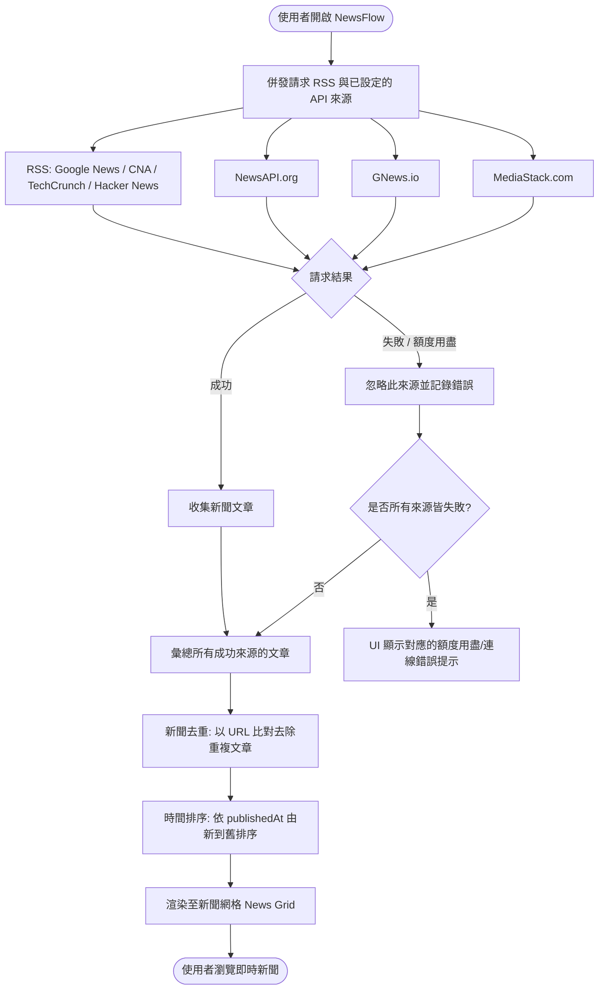

# 📰 NewsFlow — 每日新聞聚合使用者操作手冊

歡迎使用 **NewsFlow**！這是一個專為現代閱讀設計的純前端新聞聚合 Web 應用程式。系統現在會預設整合免費公開 RSS 來源，並可選擇搭配 NewsAPI、GNews、MediaStack API Key 取得更多新聞結果。

---

## 1. 系統運作流程圖

NewsFlow 透過底層的多來源併發架構，自動為您彙總、去重並排序免費公開 RSS 與多個國際新聞 API 來源。以下是系統載入新聞時的運作邏輯：



---

## 2. 新聞資料來源

NewsFlow 目前會自動整併以下來源：

| 類型 | 來源 | 用途 |
|------|------|------|
| RSS | Google News RSS | 依關鍵字動態搜尋新聞 |
| RSS | 中央社 CNA | 台灣新聞補充來源 |
| RSS | TechCrunch | 科技與商業新聞補充來源 |
| RSS | Hacker News | 科技社群與開發者新聞補充來源 |
| API | NewsAPI.org | 選填，提供更多國際新聞 |
| API | GNews.io | 選填，提供更多搜尋與頭條結果 |
| API | MediaStack | 選填，提供更多國際新聞結果 |

RSS 來源不需要 API Key。若 API 來源失敗、額度用盡或未設定，系統仍會嘗試顯示 RSS 結果。

## 3. 快速入門與設定

NewsFlow 預設會使用免費公開 RSS 來源；API Key (金鑰) 為選填，設定後可取得更多 API 新聞結果。

### 步驟 1：選擇是否申請 API 金鑰
您可以選擇申請以下一至多個新聞 API 服務的免費金鑰：
- **NewsAPI** (推薦)：至 [newsapi.org](https://newsapi.org/register) 免費註冊申請。
- **GNews**：至 [gnews.io](https://gnews.io) 免費申請。
- **MediaStack**：至 [mediastack.com](https://mediastack.com) 免費申請。

> [!TIP]
> 申請多個 API 金鑰可以帶來更好的容錯體驗。未設定 API Key 時，NewsFlow 仍會透過 Google News RSS、中央社、TechCrunch、Hacker News 提供新聞結果。

### 步驟 2：設定環境變數
1. 在專案根目錄中，將 `.env.example` 檔案複製一份並重新命名為 `.env`：
   - **Windows** (PowerShell): `copy .env.example .env`
   - **macOS / Linux**: `cp .env.example .env`
2. 使用文字編輯器開啟 `.env` 檔案，填入您申請到的 API 金鑰；若只想使用 RSS，可保持空白：
   ```env
   VITE_NEWS_API_KEY=您的_NewsAPI_金鑰
   VITE_GNEWS_API_KEY=您的_GNews_金鑰
   VITE_MEDIASTACK_API_KEY=您的_MediaStack_金鑰
   ```

### 步驟 3：安裝與啟動
在終端機中依序執行以下指令：

```bash
# 1. 安裝套件依賴
npm install

# 2. 啟動開發伺服器
npm run dev
```

啟動後，請在瀏覽器中開啟 `http://localhost:5173` 即可開始使用！

> [!IMPORTANT]
> 每次修改 `.env` 檔案後，**必須重新啟動開發伺服器**（在終端機按 `Ctrl + C` 關閉後重新執行 `npm run dev`），系統才能成功載入新的環境變數。

---

## 4. 介面操作指南

NewsFlow 的介面採用精簡、無障礙的雙欄佈局：

### 📁 左側側邊欄（Sidebar）
側邊欄是您的篩選中心，提供多維度的新聞篩選：
* **搜尋新聞**：
  * 輸入關鍵字後，系統會於 **400 毫秒 (Debounce)** 後自動發送搜尋請求，避免頻繁發送無效請求。
  * **搜尋模式**：一旦啟用搜尋，系統會暫時停用「地區」與「類別」篩選，改以全站關鍵字搜尋；Google News RSS 會依關鍵字動態查詢，固定 RSS 來源會以標題與摘要進行前端過濾。
  * 點擊輸入框右側的 `×` 按鈕可一鍵清除關鍵字並返回預設首頁。
* **類別 Pills 篩選**：
  * 提供「全部、商業、科技、科學、健康、娛樂、體育」等多個分類按鈕。
  * 選中特定類別時，Pill 會呈現專屬的高對比代表色（如「商業」為綠色、「科技」為青藍色），便於視覺快速識別。
* **地區下拉選單**：
  * 預設為 **「不區分」**，系統將拉取全球即時新聞。
  * 您亦可選擇特定的國家/地區（如美國、台灣、中國大陸、日本、韓國）以集中閱讀該地區的專利或報導。

### 📰 右側主內容區（Main Content）
主要的新聞呈現區，包含：
* **新聞網格 (News Grid)**：
  * 自動適應螢幕大小，採用響應式設計（RWD）：桌機 3 欄 / 平板 2 欄 / 手機 1 欄。
* **新聞卡片 (News Card)**：
  * 每張卡片均顯示新聞封面圖、媒體來源、發布時間、標題、摘要。
  * 若新聞沒有封面圖，會顯示質感的預設佔位圖。
  * 點擊卡片標題或「閱讀全文」，會於新分頁開啟原始報導網頁。
* **分頁導航 (Pagination)**：
  * 提供分頁切換，為保護免費帳戶並維持 RSS 合併結果穩定，最大分頁限制為 **5 頁** (共 100 筆結果)。
  * 當您切換地區、類別或輸入關鍵字時，頁碼會**智慧自動重設回第 1 頁**。

---

## 5. 常見問題與障礙排除 (FAQ)

### ❓ 問題一：沒有設定 API Key 還能使用嗎？
* **答案**：可以。NewsFlow 會預設使用 Google News RSS、中央社、TechCrunch、Hacker News。
* **補充**：設定 API Key 可以增加 API 新聞結果來源，但不是啟動 NewsFlow 的必要條件。

### ❓ 問題二：網頁呈現「API 配額已用盡」錯誤提示
* **原因**：
  * NewsAPI 的免費 Developer Plan 限制每天 100 次請求。
  * GNews 的免費方案限制每天 100 次請求。
  * MediaStack 限制每月 1,000 次請求。
  * 當您配置的 API 金鑰超過今日/當月的免費額度限制時，該 API 來源會失敗。
* **排除方法**：
  * 建議在 `.env` 中同時填入三個來源的金鑰，以啟動自動容錯機制。
  * 稍等一段時間（如隔日重置）或更換其他免費金鑰。
  * 若 RSS 來源仍可連線，頁面仍會顯示 RSS 新聞。

### ❓ 問題三：RSS 或 API 新聞讀取失敗
* **原因**：本專案採用 `corsproxy.io` 做為 CORS 跨網域代理伺服器。若代理伺服器暫時壅塞，或個別 RSS/API 來源暫時不可用，可能會導致連線超時。
* **排除方法**：請點擊頁面上的 **「重新嘗試」** 按鈕以再次發送請求，或檢查您的網路連線。

---

## 6. 專案維護與建置

若是開發者需要進行二次開發或打包佈署：

```bash
# 執行自動化測試
npm test

# 執行 ESLint 語法檢查
npm run lint

# 執行 TypeScript 靜態型別檢查與 Vite 打包建置
npm run build

# 本地預覽生產環境建置後的結果
npm run preview
```

Vite 建置產出之靜態檔案將儲存於 `/dist` 資料夾，即可直接部署至 Netlify、Vercel 或 GitHub Pages 等靜態託管平台。
